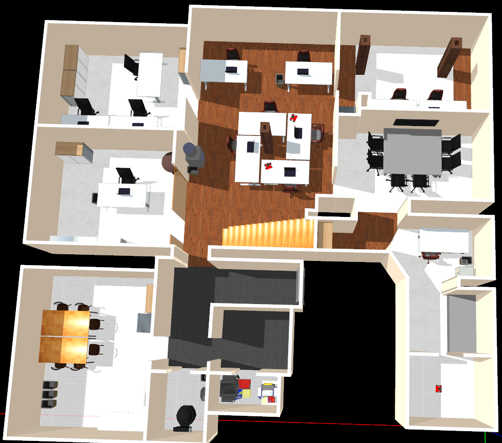
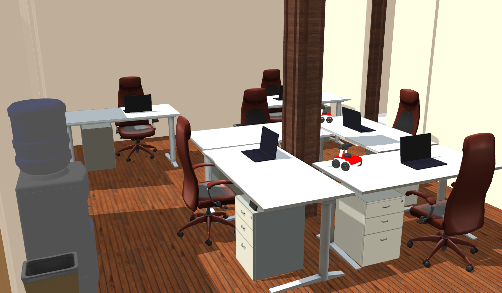

# husarion_office_gz
Custom made gazebo worlds

# Husarion office world 

## How to run 
Prepare workspace and run Gazebo:
```bash
mkdir -p ~/ros2_ws/src
cd ~/ros2_ws/src
git clone https://github.com/husarion/husarion_office_gz.git
git clone -b foxy https://github.com/husarion/rosbot_description.git

cd ~/ros2_ws
colcon build
source install/setup.bash
source /usr/share/gazebo-11/setup.bash
export GAZEBO_MODEL_PATH=$GAZEBO_MODEL_PATH:<dir/to/workspace>/install/husarion_office_gz/share/husarion_office_gz/worlds/models/

ros2 launch husarion_office_gz husarion_office_world.launch.py
```


## Results


